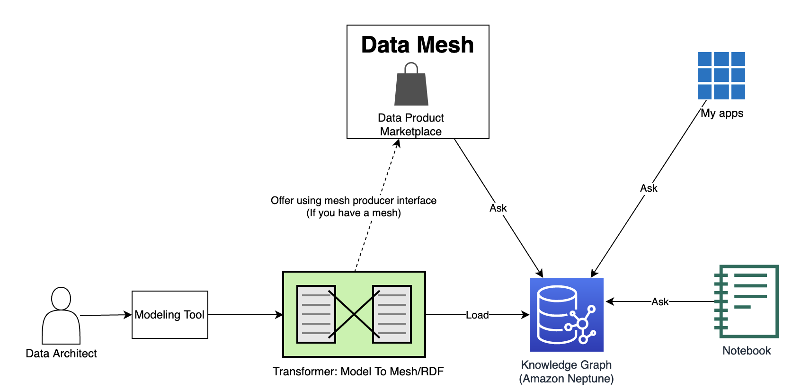

# Using Amazon Neptune to Model a Multimodel Database Solution

This is an example accompanying my talk/blog post on multi modeling. It shows how to use ontology to model data products in a multi-model solution. It also shows the use of Knowledge Graph as one model within the multimodel. 

NOTE: This setup will be simplified soon using CloudFormation.

## If you missed the talk ... 
Customers -- either right out of the gate, or after consideration -- want to build solutions with multiple models. They might want to build a movie solution that includes a movie document store, data lake, knowledge graph, video analysis, and story analysis. 

There are several models here. In AWS, you would combine DocumentDB, OpenSearch, ElastiCache, Neptune, S3, DynamoDB, plus data lake services Glue, Athena, Lake Formation. That's a lot of different ways of representing data. A lot of models. It's like the customer bought nearly every DB service on truck. Here's what the AWS truck looked like when it arrived.

But all the models seem to belong. The data architect must find a way to bring them together. Among the challenges is to build queries that need to pick data from several models in one shot. Like the movie goofs combined query:

So how to model this? The data architect pretends they have a data mesh, even if they don't have one. It just helps to break down the problem into a set of data products and to understand how they all relate. Let's throw in Knowledge Graph, which has among its capabilities the ability to keep data products relationships. Mesh needs KG. Mesh makes better product cross-sell recommendations with help from KG. So we give the data architect a conventional way to define data products and how they relate. UML proves to be an effective representation, though I discuss others in the talk. I tried it in the UML tool MagicDraw and was pleased with the results. I broke it down as follows:

- A profile containing common stereotypes of data products and their relationships. [XMI](uml/MMProfile.xml), [Diagram](uml/MMProfile.png).  
- A model of the document store products. [XMI](uml/MovieDoc.xml), [Diagram](uml/MovieDoc.png).
- A model of the lake products. [XMI](uml/DataLake.xml), [Diagram](uml/DataLake.png).
- A model of the KG products. The KG serves two purposes. It has all product definitions plus their relationships. It also is one of the models, it offers its own products, and those products have many instances in the graph! [XMI](uml/KnowledgeGraph.xml), [Diagram](uml/KG.png).
- A model of the video analysis products. [XMI](uml/VideoAnalysis.xml), [Diagram](uml/VideoAnalysis.png).
- A model of the story analysis products. [XMI](uml/StoryAnalysis.xml), [Diagram](uml/StoryAnalysis.png).

UML is easy to generate code from. It is represented in XML, or more particularly XML Metadata Interchange (XMI), form. Using common XML parsers, it is possible to transform the UML to two forms: (a) The format used by the data mesh to accept new data product definitions for its marketplace, (b) An RDF representation for the Knowledge Graph. This repo shows a demonstration of the process.

The demo has three main parts:
1. Drawing the UML models. Done! Try the UML links above.
2. Converting UML to RDF. Coming soon! 
3. Ingesting the RDF to Amazon Neptune and asking questions via SPARQL questions about products and their relationships. Follow the instructions below.

## Pre-requisite
- You need an Amazon Neptune cluster with a Neptune Workbench notebook instance.  See https://docs.aws.amazon.com/neptune/latest/userguide/neptune-setup.html. 
- You need an S3 bucket in the same region as your Neptune cluster. Your Neptune cluster needs an IAM role with read access to the bucket. See https://docs.aws.amazon.com/neptune/latest/userguide/bulk-load-tutorial-IAM.html. 
- Your notebook instance needs read/write access to that S3 bucket. Find the IAM role for your notebook instance and add a policy to enable that S3 access.  See https://docs.aws.amazon.com/sagemaker/latest/dg/gs-setup-working-env.html.

## Steps to setup:
1. Clone this repo.
2. In your notebook instance, select the Jupyter files tab. Upload your local cloned copy of MultiModel.ipynb (in the multimodel folder).
3. Open the MultiModel.ipynb notebook in Jupyter.
4. Follow the steps described in the notebook. You need to make one edit. In the code cell under "Set the name of an S3 bucket in the same region that Neptune has access to", edit your S3 bucket name as the value of S3_BUCKET.

## Representing the products in UML and RDF
This demo shows both UML and RDF representations of data products. The UML representation is based on a profile of product stereotypes

The RDF representation is a (data product ontology)[mm_movie.ttl]. It is held in the KG. As mentioned above, the KG has both products definitions plus its own products! The ontology file, for convenience, contains both. 

The following chart describes how products and relationships are represented.

Thing to represent|UML|Ontology|Params|
|:----|:----|:----|:----|
|Product|Stereotype DataProduct on class|Class that is subclass of :DataProduct| |
|Implementation|Stereotype DataProductImpl on class|Class that is subclass of :DataProduct| |
| | | | |
| |Stereotype hasImpl on usage rel from product or impl class to impl class|Annotation property :hasImpl from product/impl class to impl class| |
|Caches, copies, located in|Stereotype on usage rel from product/ impl class to product/impl class|Annotation property :hasImpl from product/impl class to product/impl class| |
|Usage pattern|Stereotype usagePattern on product class or its package. Each pattern is a pattern tag|Annotation property :usagePattern on product class.|UML tag: pattern (1..*): string. 
In RDF, a string object.|
|Federates|Stereotype federates on product/impl class.|Annotation property :federates on product/ impl class.|UML tag fedURI (1..*): string. 
In RDF, a string or URI object.|
|Joins|Stereotype joins on usage rel from product/impl class to product/impl class.|Annotation property :joins on product/ impl class.|UML: joinAttib to specify prop names in target class. Use myAttrib if source class props are named differently. Match up one for one.|
| | | | |
| | | |In RDF, the object is a Join individual with :hasNeighbor and :hasNeighborAttribute triples pointing to neighbor.|
|Refer To|Similar to joins|Similar to joins|UML: similar. Use refersAttrib and myAttrib.|
| | | | |
| | | |RDF: similar. The object is a Ref individual.|
|Product Key|Stereotype productKey on property of product/impl class|owl:hasKey of product/impl class| |
|AWS Service|Stereotype awsService on impl class.|Annotation property :awsService on impl class|UML: service[1]: string.|
| | | | |
| | | |RDF: string or URI of AWS service name.|
|AWS Resource|Similar to AWS Service|Similar to AWS Service|UML: resource[1]: string.|
| | | | |
| | | |RDF: string or URI of AWS resource name.|
|Has source|Stereotype hasSource at multiple levels. Can be on product/impl class. Can be a package level, indicating all products in the package have the source. Can be on usage rel, indicating that the source class/package is sourced from the target class/package|Annotation property :hasSource on product/impl class.|UML: integrationType[0,1], sourceDataSet[*], sourceEventType[0,1]|
| | | | |
| | | |In RDF, the object is a Source individual with triples like the above. If the target is a product/impl, it uses hasNeighbor.|
|Similar to|Stereotype similarTo on usage rel from product class to product class.|Annotation property :similarTo on product class|UML simReason[0,1], simAlgorithm[0,1]|
| | | | |
| | | |In RDF, the object is a Similarity individual with triples like the above.|
|Config|Stereotype config on any element|RDF is looser. Individual annotation properties, such as awss3:Tier are used.|UML: configKV[1..*]. Express as string of form K,V|

## License
The ontology and notebook are licensed under the MIT-0 License. See the LICENSE file.
