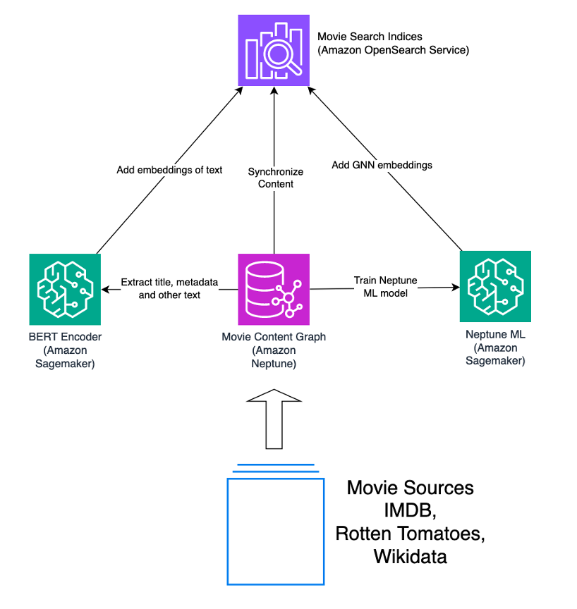
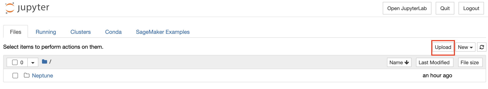

# Demo: Make relevant movie recommendations using Amazon Neptune, Amazon Neptune Machine Learning, and Amazon OpenSearch Service

The following demo accompanies the blog post "Make relevant movie recommendations using Amazon Neptune, Amazon Neptune Machine Learning, and Amazon OpenSearch Service." 

## Solution
The blog post discusses a design for a highly searchable movie content graph database built on [Amazon Neptune](https://aws.amazon.com/neptune/), a managed graph database service. We demonstrate how to build a list of relevant movies matching a user's search criteria through the powerful combination of lexical, semantic, and graphical methods with Neptune, [Amazon OpenSearch Service](https://aws.amazon.com/opensearch-service/), and [Neptune Machine Learning](https://aws.amazon.com/neptune/machine-learning/).

We explore a solution for combined lexical, semantic, and graphical search through two lenses. First we will walk through the end-user search experience, then we will discuss populating our search data stores.

The first figure seen below, illustrates the solution from the end-user search perspective. The user first initiates a search on indices in OpenSearch Service, passing in  a search term as input. This input is first matched on lexical matches for direct keyword similarities. Next, the same input is parsed into a vector embedding representation and compared to embedding data in OpenSearch through vector similarity search. The input is then searched graphically by comparing it to graph embedding space data in OpenSearch. As a final step, the search may also explore neighbors in the Amazon Neptune graph database for locally related results. The results of steps 1, 2, and 3 will return specific node ID’s for movies within the content graph which can then be explored through graph traversals, connecting the results to connected movie titles.


 
The next figure illustrates the second solution perspective, how the data is populated. In this solution, the primary store is a movie content data graph in Neptune. It is populated from sources such as IMDB, Rotten Tomatoes, Wikidata, and others. Our demo uses IMDB only. The OpenSearch cluster contains a copy of the movie content data in a searchable text index. OpenSearch also contains embeddings, or vector representations of movies which support nearest-neighbor search query patterns.



There are two types of embeddings which we produce using [Amazon Sagemaker](https://aws.amazon.com/sagemaker/): 

1.	Embeddings which represent the text attributes of the movie, including its title, genres, and metadata. In order to turn these features into embeddings we use a Bidirectional Encoder Representations from Transformers (BERT) model. The BERT model consumes the text features as input, and outputs a vector representation of the inputs in the form of an embedding. These embeddings enable semantic matching of movie-related text.
2.	Embeddings which represent the full movie’s context and its graph neighborhood. We use [Neptune Machine Learning (Neptune ML)](https://docs.aws.amazon.com/neptune/latest/userguide/machine-learning.html) to produce embeddings based on Graph Neural Networks (GNN).  These embeddings enable graphical-similar matching of movies based on comparison of their embeddings alone. 

## Setup
To setup this solution, you need an AWS account with permission to create resources such as a Neptune cluster, and OpenSearch Service cluster, S3 bucket, and SageMaker resources. Also select a single region in which to deploy your resources, ensure that Amazon Neptune, Amazon OpenSearch Service, Amazon Sagemaker, and S3 are all available for deployment in said region.

### Amazon Simple Storage Service (S3) Bucket Setup
Create an Amazon Simple Storage Service (S3) bucket in the same account and region in which you deploy the other resources. This bucket is used to store embeddings produced by Neptune ML model training.

Follow instructions in [https://docs.aws.amazon.com/AmazonS3/latest/userguide/create-bucket-overview.html](https://docs.aws.amazon.com/AmazonS3/latest/userguide/create-bucket-overview.html). The bucket may be private and use default encryption. Take note of your bucket name and resource ARN for upcoming deployment steps.

### Amazon Neptune Cluster Setup
Create a Neptune cluster and a notebook instance. One way to setup these resources is using the CloudForamtion template via [https://docs.aws.amazon.com/neptune/latest/userguide/get-started-cfn-create.html](https://docs.aws.amazon.com/neptune/latest/userguide/get-started-cfn-create.html). We recommend using a `NotebookInstanceType` of `ml.t3.large` or higher.

When the CloudFormation stack completes do the following. 

First, locate the Neptune cluster and *make note of its VPC and subnets*. You will need these when creating the OpenSearch Service domain to ensure you create resources that can connect to eachother.


Second, locate the notebook in the SageMaker console. Find its IAM role under `Permissions and encryption` on the details page for the notebook. Select that role and add IAM policies as follows:


- The notebook should already have read access to all S3 buckets. Add write access to the S3 bucket you created above. One way to accomplish this is to add the `AmazonS3FullAccess` managed policy.
- The notebook should be able to create and execute the SageMaker pipeline for Neptune ML. One way to accomplish this is to add the `AmazonSageMakerFullAccess` managed policy.
- The notebook should be able to read from and write to your Amazon OpenSearch Service Domain. One way to accomplish this is to add the `AmazonOpenSearchServiceFullAccess` managed policy.

Also, *make note of the role ARN*. You will need it when running through the notebooks.

### Amazon OpenSearch Service Domain Setup
In the Opensearch Service console, create a new domain as follows;
- Use standard create.
- To test a single AZ deployment for sandbox purposes, choose `Dev/test` template.
- To test a single AZ deployment for sandbox purposes, choose `Domain without standby` with `1-AZ` deployment option.
- Use version OpenSearch 2.7 or higher.
- Under `network`, choose the same VPC in which your Neptune cluster is deployed. For subnets, choose one of the subnets under the Neptune cluster.
- For security group, use a security group allowing inbound access to port 443.
- For simplicity, we disable fine-grained access control. If you require it, keep it enabled and refer to <https://docs.aws.amazon.com/opensearch-service/latest/developerguide/fgac.html> for details on how this mechanism works. You will also need to change code in the notebook that creates the OpenSearch client. Refer to the API documentation at <https://github.com/opensearch-project/opensearch-py/blob/main/opensearchpy/client/__init__.py>.

Once setup, *make note of the domain endpoint*. You will need it when running through the notebooks.

For more on creating domains, see [https://docs.aws.amazon.com/opensearch-service/latest/developerguide/createupdatedomains.html](https://docs.aws.amazon.com/opensearch-service/latest/developerguide/createupdatedomains.html). 

### Run through the notebooks
Download the three notebook `ipynb` files to your local machine:

- [https://github.com/aws-samples/amazon-neptune-ontology-example-blog/blob/main/notebook/aos_movie_search/01-PopulateAndExploreNeptune.ipynb](https://github.com/aws-samples/amazon-neptune-ontology-example-blog/blob/main/notebook/aos_movie_search/01-PopulateAndExploreNeptune.ipynb)
- [https://github.com/aws-samples/amazon-neptune-ontology-example-blog/blob/main/notebook/aos_movie_search/02-PopulateOpenSearch.ipynb](https://github.com/aws-samples/amazon-neptune-ontology-example-blog/blob/main/notebook/aos_movie_search/02-PopulateOpenSearch.ipynb)
- [https://github.com/aws-samples/amazon-neptune-ontology-example-blog/blob/main/notebook/aos_movie_search/03-Search.ipynb](https://github.com/aws-samples/amazon-neptune-ontology-example-blog/blob/main/notebook/aos_movie_search/03-Search.ipynb)

In the notebook instance, open Jupyter. Upload the three notebook files to Jupyter.



Once uploaded, run notebook `01-PopulateAndExploreNeptune.ipynb`. 

When complete, run notebook `02-PopulateOpenSearch.ipynb`. Run all cells.  In the initial code cell, replace values in angled brackets with values for your environment. 

```
TARGET_S3_PATH_NOSLASH="s3://<your bucket>/movie/gnn"
# Replace the below red string with your own Amazon OpenSearch endpoint
AOS_ENDPOINT="<your AOS endpoint>"
# Replace the below red string with your own IAM role for the GNN embedding pipeline.
SAGEMAKER_ROLE="<your IAM role for GNN pipeline>"
```

Replace `<your bucket>` with the name of your previously noted bucket.

Replace `<your AOS endpoint>` with the endpoint of your OpenSearch Service domain.

Replace `<your IAM role for GNN pipeline>` with the IAM role for the notebook instance. 

When complete, run notebook `03-Search.ipynb`. In this notebook you will see the results of your setup and explore your outcomes.

## Cleanup
To cleanup the resources you created above:
- Delete the CloudFormation stack you created for the Neptune cluster and notebook instance.
- Delete the S3 bucket you created. See [https://docs.aws.amazon.com/AmazonS3/latest/userguide/delete-bucket.html](https://docs.aws.amazon.com/AmazonS3/latest/userguide/delete-bucket.html). 
- Delete the OpenSearch Service domain you created. You may do this from the Opensearch Service console. Or see [https://awscli.amazonaws.com/v2/documentation/api/2.7.12/reference/opensearch/delete-domain.html](https://awscli.amazonaws.com/v2/documentation/api/2.7.12/reference/opensearch/delete-domain.html). 

## Cost
This solution incurs cost. Refer to pricing guides for [Neptune](https://aws.amazon.com/neptune/pricing/),[S3](https://aws.amazon.com/s3/pricing/), [OpenSearch Service](https://aws.amazon.com/opensearch-service/pricing/), and [SageMaker](https://aws.amazon.com/sagemaker/pricing/).

