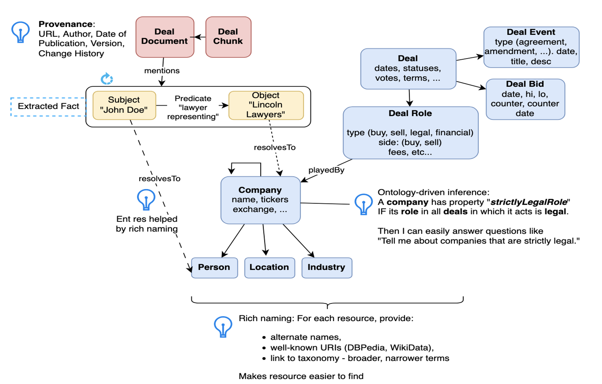
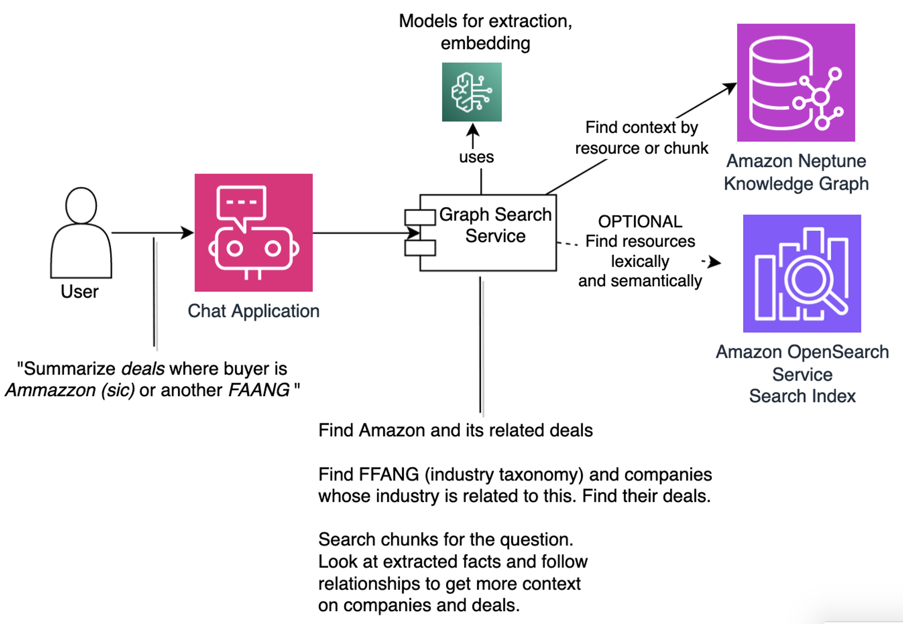

# Graph RAG Patterns in Amazon Neptune
This repository provides code samples that accompany presentations on Generative AI with Amazon Neptune. 

In those presentations, we describe why Knowledge Graph improves Generative AI. We argue that retrieval-augmented generation (RAG) improves responses to questions that a user asks in a generative AI application. RAG hits your enterprise database to provide the large language model (LLM) current, accurate, relevant context to answer the question. A graph database provides such context. Furthermore, because a graph navigates relationships, it can pull in additional context that explains and elaborates the result. 

We demonstrate three Graph RAG patterns. 

1. The LLM generates the graph query. RAG involves running that query against the graph database and having the LLM summarize the results. For more, see <https://python.langchain.com/v0.1/docs/integrations/graphs/amazon_neptune_open_cypher/> and <https://python.langchain.com/v0.1/docs/integrations/graphs/amazon_neptune_sparql/>.

2. The graph represents unstructured data as embeddings (in chunks if necessary). It links these embeddings to structured resources. When the user asks a question, we first match similar embeddings in the graph, then we pull in related structured resources. We pass this as context to the LLM to answer the question. To try this out, take a look at <https://github.com/aws-samples/amazon-neptune-ontology-example-blog/blob/main/notebook/kg_ai_alg>, particularly <https://github.com/aws-samples/amazon-neptune-ontology-example-blog/blob/main/notebook/kg_ai_alg/2x-TryVSSAndRAGOnChunks.ipynb>.

3. The LLM builds the graph as a network of relationships extracted from unstructured data. To answer the user's question, we query that LLM-driven graph! To try this out, take a look at <https://github.com/aws-samples/amazon-neptune-ontology-example-blog/blob/main/notebook/kg_ai_alg>, particularly <https://github.com/aws-samples/amazon-neptune-ontology-example-blog/blob/main/notebook/kg_ai_alg/2-CreateLlamaIndex.ipynb>.

## Variant: Extremely Searchable Graph

In a recent talk, we emphasized the benefit of arranging your knowledge graph so that it is extremely searchable in a generic way while not breaking your existing data. We propose a model that allows unstructured data as documents, chunks, and extracted triples or facts. This data is linked to your structured data. The next figure shows a deal graph model that aligns with the approach. Red boxes are documents and chunks. Yellow boxes are extracted facts. Blue boxes are existing structured data: companies, persons, deals, etc.

Note the tips:
- *Provenance*: Include provenance of the document. If a chunk or extracted facts are included in RAG context, it's important to attribute them to their source document. Who is the author, when was it published, what is its URL, which version.
- *Taxonomy and rich naming*. Besides your own IDs, include alternate and related labels and well-known URIs (such as from DBPedia) for each resource. This makes resources easier to find.
- *Entity resolution*: Use rich naming to help link extracted entities to resources in your graph. Ask the extraction service (e.g., an LLM model) to provide alternate names and well-known URIs for extracted entities. Compare these to the names and URIs of your resources.

This model can be mapped to either labeled property graph (LPG) or RDF.

Next, the following figure shows the main components used to help a chatbot answer questions.

- It uses LLM models via Amazon Bedrock for creating embeddings and extracting entities. As an alternative, Amazon Comprehend can be used for entity extraction.
- The knowledge graph is built on Amazon Neptune. For LPG, you can use either Neptune Analytics of Neptune database. For RDF, you must use Neptune database.
- We use a search index built on Amazon OpenSearch Service. It serves two purposes: A) Enable enhanced lexical (e.g, fuzzy) and semantic search of resources; B) Enable full-fledged vector similarity search of chunks and extracted facts for answering questions. For the LPG solution built using Neptune Analytics, this index can be used for purpose A; it is optional. For LPG or RDF solutions built on Neptune database, the search index fills the critical role of B and is therefore required. It can also optionally fill role A.

Here is the RAG process to receive a natural language question and add context to the prompt for response:

- Extract keywords from the question. Use an LLM. Ask the LLM for alternate names and well-known URIs of each keyword.
- Via the search index and/or the graph directly, find resources for the extracted keywords. Rich naming helps. Enhanced search capability helps. Blue and yellow boxes can match.
- For each resource, bring back its details as well as its neighborhood. This includes blue and yellow boxes. If the match is yellow, bring back the source document and chunk too (red boxes), as well as the document's provenance.
- Perform a vector search on chunks of the question. For close-matching chunks, bring in the neighborhood too, including yellow and blue boxes. Also bring back provenance.

Watch this page for a link to a demo of the approach.

