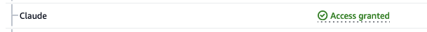
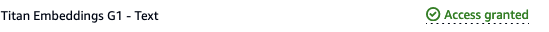

# KGC 2024 MasterClass: Generating and analyzing knowledge graphs using GenAI and Neptune Analytics

This folder contains the demo accompanying the masterclass _Generating and analyzing knowledge graphs using GenAI and Neptune Analytics_ presented at Knowledge Graph Conference 2024 (<https://events.knowledgegraph.tech/event/7ffec6d4-b17d-4fce-b55c-fcd77fa58146/summary>). 

Here are instructions to setup the demo.

## Pre-requisites

You require an AWS account with permissions to create Amazon Neptune (<https://aws.amazon.com/neptune>) , Amazon Bedrock (<https://aws.amazon.com/bedrock>), Amazon SageMaker (<https://aws.amazon.com/sagemaker>), Amazon EC2 (<https://aws.amazon.com/ec2/>) , and Amazon Simple Storage Service (S3) (<https://aws.amazon.com/s3/>) resources.

Provision all resources in the same region. Use a region that supports both Neptune Analytics and Bedrock. See <https://docs.aws.amazon.com/neptune-analytics/latest/userguide/analytics-limits.html> and <https://docs.aws.amazon.com/bedrock/latest/userguide/bedrock-regions.html>.

We recommend using us-east-1 or us-west-2.

For simplicity, provision all resources in the same AWS account.

## Setup

### Allow Bedrock models

In your AWS console, open the Bedrock console and request model access for the _Titan Embeddings G1_ and _Claude_ models. For instructions how to request model access, follow <https://docs.aws.amazon.com/bedrock/latest/userguide/model-access.html>.

Check back until both models show as _Access granted_.

.

.

You will need these models to create the LlamaIndex indexes. 

### Create Neptune Analytics Graphs

Navigate to the Neptune console. In the left menu, select _Graphs_.

#### Create main graph

Click _Create graph_.

Fill in values as follows:

- Graph name: KGC-demo
- Data source: Create empty graph
- Enable public connectivity - check
- Setup private endpoint - uncheck
- Vector search settings. Select _Use vector dimension_. When prompted for _Number of dimensions in each vector_, enter 1536.
- Select _Create Graph_.

Wait for the graph to become available. Obtain graph identifier.

#### Create graph for chatbot

Follow the same steps as above to create a second graph. Name it KGC-demo-chatbot.

### Create Neptune Notebook

Follow instructions in https://docs.aws.amazon.com/neptune-analytics/latest/userguide/create-notebook-cfn.html to create a notebook instance through CloudFormation.

TODO - IAM role allows bedrock, S3 working bucket

### Create S3 Working Bucket

Navigate to the S3 console. Create a bucket with a unique name similar to _kgc2024-masterclass-demo-yourname_.

### Create Chatbot

We also provide a chatbot to ask natural language questions of the knowledge graph.

#### Create EC2 Instance

TODO, VPC, IAM role, need public access, SG allows you to access from your machine

#### Obtain Code

git clone

#### Obtain text data

aws s3 sync _the raw data_

#### Configure

edit graph identifier

#### Get Dependencies

pip install requirements.txt

#### Start

streamlit run main.py

## Cleanup

This demo incurs cost. If you are done and wish to avoid further charges:

- Delete the Neptune Analytics graphs (TODO)
- Stop and remove the Sagemaker notebook instance (TODO)
- Remove the S3 bucket (TODO)
