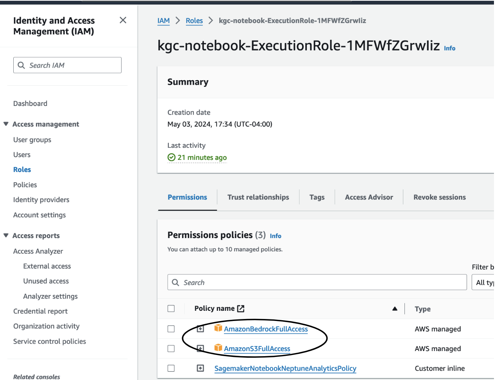

# KGC 2024 MasterClass: Generating and analyzing knowledge graphs using GenAI and Neptune Analytics

This folder contains the demo accompanying the masterclass _Generating and analyzing knowledge graphs using GenAI and Neptune Analytics_ presented at Knowledge Graph Conference 2024 (<https://events.knowledgegraph.tech/event/7ffec6d4-b17d-4fce-b55c-fcd77fa58146/summary>). 

Here are instructions to setup the demo.

## Pre-requisites

You require an AWS account with permissions to create Amazon Neptune (<https://aws.amazon.com/neptune>) , Amazon Bedrock (<https://aws.amazon.com/bedrock>), Amazon SageMaker (<https://aws.amazon.com/sagemaker>), Amazon EC2 (<https://aws.amazon.com/ec2/>) , and Amazon Simple Storage Service (S3) (<https://aws.amazon.com/s3/>) resources.

Provision all resources in the same region. Use a region that supports both Neptune Analytics and Bedrock. See <https://docs.aws.amazon.com/neptune-analytics/latest/userguide/analytics-limits.html> and <https://docs.aws.amazon.com/bedrock/latest/userguide/bedrock-regions.html>.

We recommend using us-east-1 or us-west-2.

For simplicity, provision all resources in the same AWS account.

## Setup

### Allow Bedrock models

In your AWS console, open the Bedrock console and request model access for the _Titan Embeddings G1_ and _Claude_ models. For instructions how to request model access, follow <https://docs.aws.amazon.com/bedrock/latest/userguide/model-access.html>.

Check back until both models show as _Access granted_.

.

You will need these models to create the LlamaIndex indexes. 

### Create Neptune Analytics Graphs

In your AWS console, open the Neptune console. In the left menu, select _Graphs_ and create two graphs. One will be used as the main knowledge graph for our demo. The other will be used separately by the chatbot.

Follow instructions <https://docs.aws.amazon.com/neptune-analytics/latest/userguide/gettingStarted-creating-a-graph.html> to create the graphs. 

#### Create main graph

Use the following settings: 
- Graph name: *kgc-demo*
- Data source: Create empty graph
- Enable public connectivity: check
- Setup private endpoint: uncheck
- Vector search settings: Enable these settings and set dimension to *1536*.

It will take a few minutes to create. Wait for the status of the graph to become *Available*. 

Then look in the configuration settings and note the graph identifier and endpoint. You will need these later.

.

#### Create graph for chatbot

Follow the same steps as above to create a second graph. Name it *kgc-chat*. Wait it to become available and note down its graph identifier.

### Create S3 Working Bucket

Navigate to the S3 console. Create a bucket with a unique name similar to _kgc2024-masterclass-demo-yourname_. Follow instructions in <https://docs.aws.amazon.com/AmazonS3/latest/userguide/create-bucket-overview.html>. Accept defaults. The bucket may be private and use default encryption.

### Create Neptune Notebook

Follow instructions in https://docs.aws.amazon.com/neptune-analytics/latest/userguide/create-notebook-cfn.html to create a Sagemaker notebook instance for Neptune Analytics through CloudFormation. On the stack details page provide the following:

- Stack name: *KGC-Notebook*
- GraphEndpoint: enter the endpoint from the *kgc-demo* graph you created above.
- NotebookName: *kgc-notebook*

Leave the remaining parameters blank. Navigate through the remaining pages, accepting defaults.

.

Wait for the CloudFormation stack to complete. It may take several minutes.

#### Modify Notebook IAM Role

When complete, go the SageMaker console. In the left menu select _Notebook_. Locate your notebook in the main pane. 

.

Select the notebook to see its configuration. Locate its IAM role. Click on that role to bring it up in the IAM console.

Add two policies to the permissions: 

- *AmazonBedrockReadOnly*, giving the notebook access to Bedrock models for embedding and entity extraction
- *AmazonS3FullAccess*, as the notebook will need write access to your working bucket.

.

#### Get Demo Notebook Files and Begin

Download the four notebooks from this repository:

- 0-PrepSources.ipynb
- 1-PopulateGraph.ipynb
- 2-CreateLlamaIndex.ipynb
- 3-GraphAlgorithms.ipynb

Back in the SageMaker console, open the Jupyter notebook folder view

.

In Jupyter, upload the four notebooks should downloaded to your local machine above.

.

Now run through the notebooks! *0-PrepSources.ipynb* is optional, meant mostly to show how we prepared the data. You may skip this as the prepared data is already available publicly.

### Create Chatbot

We also provide a chatbot to ask natural language questions of the knowledge graph.

#### Create EC2 Instance

TODO, VPC, IAM role, need public access, SG allows you to access from your machine

#### Obtain Code

git clone

#### Obtain text data

aws s3 sync _the raw data_

#### Configure

edit graph identifier

#### Get Dependencies

pip install requirements.txt

#### Start

streamlit run main.py

## Cleanup

This demo incurs cost. If you are done and wish to avoid further charges:

- Delete the Neptune Analytics graphs (TODO)
- Stop and remove the Sagemaker notebook instance (TODO)
- Remove the S3 bucket (TODO)
