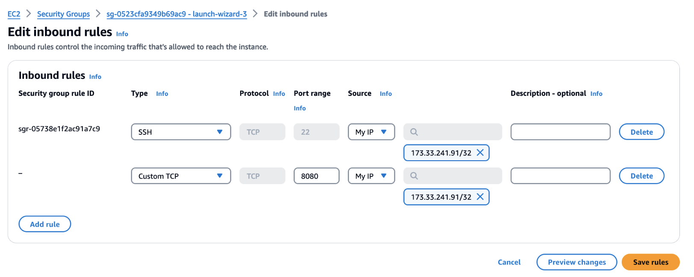
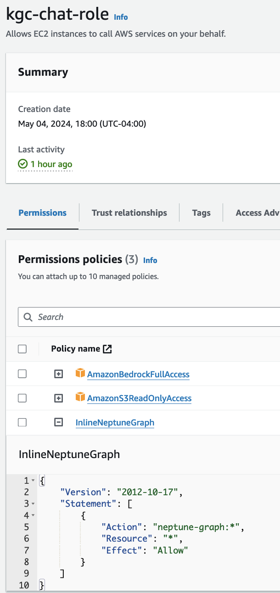

# KGC 2024 MasterClass: Generating and analyzing knowledge graphs using GenAI and Neptune Analytics

This folder contains the demo accompanying the masterclass _Generating and analyzing knowledge graphs using GenAI and Neptune Analytics_ presented at Knowledge Graph Conference 2024 (<https://events.knowledgegraph.tech/event/7ffec6d4-b17d-4fce-b55c-fcd77fa58146/summary>). 

Here are instructions to setup the demo.

## Pre-requisites

<details><summary>Click to view/hide this section</summary>
<p>


You require an AWS account with permissions to create Amazon Neptune (<https://aws.amazon.com/neptune>) , Amazon Bedrock (<https://aws.amazon.com/bedrock>), Amazon SageMaker (<https://aws.amazon.com/sagemaker>), Amazon EC2 (<https://aws.amazon.com/ec2/>) , and Amazon Simple Storage Service (S3) (<https://aws.amazon.com/s3/>) resources.

Provision all resources in the same region. Use a region that supports both Neptune Analytics and Bedrock. See <https://docs.aws.amazon.com/neptune-analytics/latest/userguide/analytics-limits.html> and <https://docs.aws.amazon.com/bedrock/latest/userguide/bedrock-regions.html>.

We recommend using us-east-1 or us-west-2.

For simplicity, provision all resources in the same AWS account.

</p>
</details>

## Setup

### Allow Bedrock models

<details><summary>Click to view/hide this section</summary>
<p>

In your AWS console, open the Bedrock console and request model access for the _Titan Embeddings G1_ and _Claude_ models. For instructions how to request model access, follow <https://docs.aws.amazon.com/bedrock/latest/userguide/model-access.html>.

Check back until both models show as _Access granted_.

.

You will need these models to create the LlamaIndex indexes. 

</p>
</details>


### Create Neptune Analytics Graphs

<details><summary>Click to view/hide this section</summary>
<p>


In your AWS console, open the Neptune console. In the left menu, select _Graphs_ and create two graphs. One will be used as the main knowledge graph for our demo. The other will be used separately by the chatbot.

Follow instructions <https://docs.aws.amazon.com/neptune-analytics/latest/userguide/gettingStarted-creating-a-graph.html> to create the graphs. 

#### Create main graph

Use the following settings: 
- Graph name: *kgc-demo*
- Data source: Create empty graph
- Enable public connectivity: check
- Setup private endpoint: uncheck
- Vector search settings: Enable these settings and set dimension to *1536*.

It will take a few minutes to create. Wait for the status of the graph to become *Available*. 

Then look in the configuration settings and note the graph identifier and endpoint. You will need these later.

.

#### Create graph for chatbot

Follow the same steps as above to create a second graph. Name it *kgc-chat*. Wait it to become available and note down its graph identifier.

</p>
</details>

### Create S3 Working Bucket

<details><summary>Click to view/hide this section</summary>
<p>


Navigate to the S3 console. Create a bucket with a unique name similar to _kgc2024-masterclass-demo-yourname_. Follow instructions in <https://docs.aws.amazon.com/AmazonS3/latest/userguide/create-bucket-overview.html>. Accept defaults. The bucket may be private and use default encryption.

</p>
</details>


### Create Neptune Notebook

<details><summary>Click to view/hide this section</summary>
<p>


Follow instructions in https://docs.aws.amazon.com/neptune-analytics/latest/userguide/create-notebook-cfn.html to create a Sagemaker notebook instance for Neptune Analytics through CloudFormation. On the stack details page provide the following:

- Stack name: *KGC-Notebook*
- GraphEndpoint: enter the endpoint from the *kgc-demo* graph you created above.
- NotebookName: *kgc-notebook*

Leave the remaining parameters blank. Navigate through the remaining pages, accepting defaults.

.

Wait for the CloudFormation stack to complete. It may take several minutes.

#### Modify Notebook IAM Role

When complete, go the SageMaker console. In the left menu select _Notebook_. Locate your notebook in the main pane. 

.

Select the notebook to see its configuration. Locate its IAM role. Click on that role to bring it up in the IAM console.

Add two policies to the permissions: 

- *AmazonBedrockFullAccess*, giving the notebook access to invoke Bedrock models for embedding and entity extraction
- *AmazonS3FullAccess*, as the notebook will need write access to your working bucket.

If you prefer narrower permissions, create your own policy that restricts S3 writes to only your working bucket and Bedrock invokes to only the Claude and Titan models.

.

#### Get Demo Notebook Files and Begin

Download the four notebooks from this repository:

- 0-PrepSources.ipynb
- 1-PopulateGraph.ipynb
- 2-CreateLlamaIndex.ipynb
- 3-GraphAlgorithms.ipynb

Back in the SageMaker console, open the Jupyter notebook folder view

.

In Jupyter, upload the four notebooks should downloaded to your local machine above.

.

Now run through the notebooks! *0-PrepSources.ipynb* is optional, meant mostly to show how we prepared the data. You may skip this as the prepared data is already available publicly.

</p>
</details>


### Create Chatbot

<details><summary>Click to view/hide this section</summary>
<p>


We also provide a chatbot to ask natural language questions of the knowledge graph.

#### Create EC2 Instance

In the EC2 console, create an instance on which to run the chatbot. Select *Launch Instance*. Use the following settings:

- Name: *kgc-chat*
- Application/OS Image: *Amazon Linux 2023*
- Intance type: *t2.medium*
- Key Pair: create new and call it *kgc-chat*
- Network settings. VPC: Use the default VPC, which should already be selected.
- Network settings. Subnet: Choose a subnet that is public.

Use default values for the remaining settings. In the EC2 console, located the instance and wait for the instance to enter *Running* status. Select the instance to see its settings. Note down the Public IP address. You will need it later.


#### Modify EC2 Security Group

In the settings pane of the EC2 instance, select the _Security_ tab. Find the security group for the instance and click on it.  


Edit the inbound rules of the security group as follows:

- Restrict access to port 22 (for SSH) to your local machine's IP address.
- Add a rule to allow access to port 8080 to your local machine's IP address. The chatbot will listen on this port.

This restricts access to the machine and the chatbot to only your machine.




#### Modify EC2 IAM Role

In the EC2 console, select the instance. From the _Actions_ menu choose _Security_ | _Modify IAM Role_. 


This takes you to a page to manage the IAM role for the instance. Select _Create new IAM role_. This opens the IAM console to allow you to define the role.  Create a role with a trust relationship for ec2 and permissions on Bedrock, S3, and Neptune Analytics. 




Name the role *kgc-chat-role*.

In the _Modify IAM Role_ page, associate this new role with the instance.


#### Connect to EC2 Instance

Open an SSH session to the instance. For instructions on how to do this, select _Connect_ | _SSH client_ from the details pane of your instance. 

For example, if your local machine is a Mac, the key file *kgc-chat.pem* was downloaded to your machine when setting up the instance. You can SSH to it as follows, substituting the public IP of your instance:

```
chmod 400 ~/Downloads/kgc-chat.pem
ssh -i ~/Downloads/kgc-chat.pem ec2-user@<my_public_ip>
```

##### Obtain Code

In the SSH session, obtain the source code for the chatbot as follows:

```
git clone xxx
```

##### Obtain text data

In the SSH session, obtain the press release documents by running:

```
aws s3 sync s3://aws-neptune-customer-samples-us-east-1/kgc2024_na/rawtext data
```

##### Configure

edit graph identifier

##### Get Dependencies

pip install requirements.txt

##### Start

streamlit run main.py

##### Access the chatbot from your browser

TODO

</p>
</details>

## Cleanup

<details><summary>Click to view/hide this section</summary>
<p>


This demo incurs cost. If you are done and wish to avoid further charges:

- Delete the Neptune Analytics graphs (TODO)
- Stop and remove the Sagemaker notebook instance (TODO)
- Remove the S3 bucket (TODO)
- Terminate the EC2 instance (TODO)

</p>
</details>

