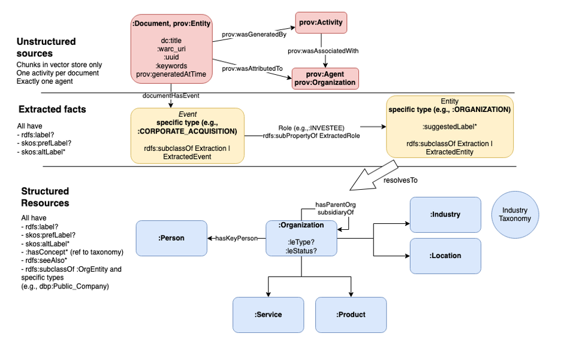
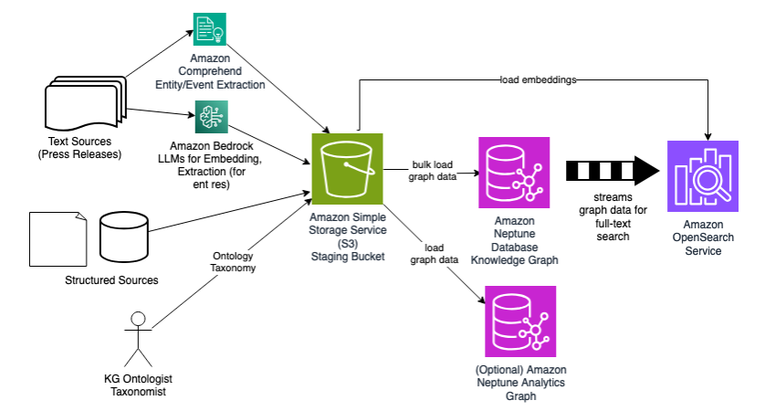
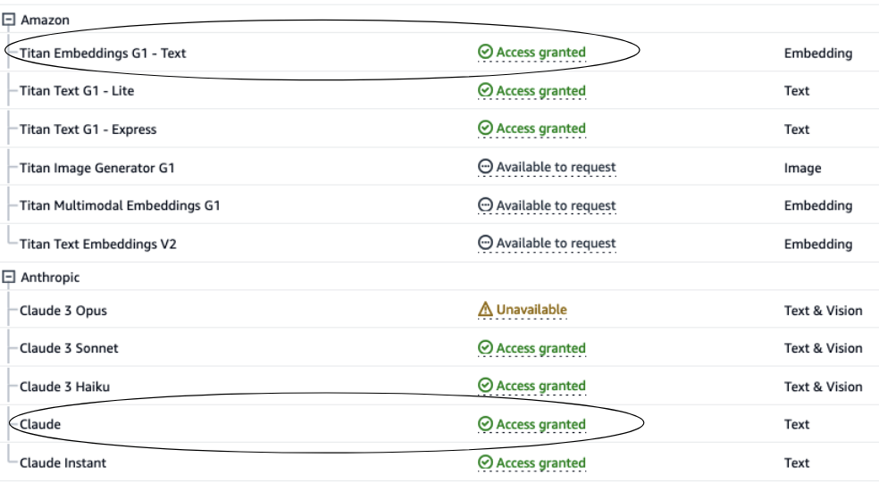
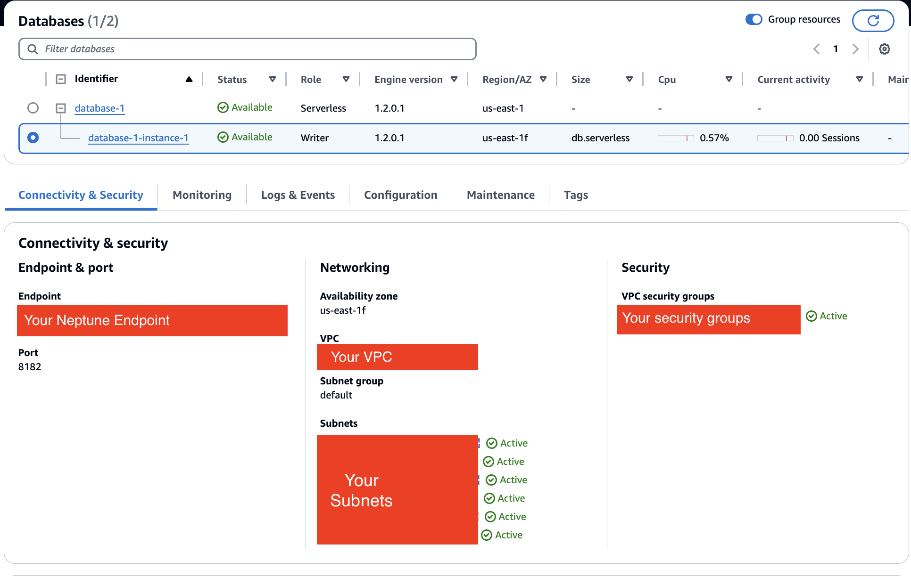

# Toronto Machine Learning Summit 2024: Ask the Graph: How Knowledge Graphs Helps Generative AI Models Answer Questions

## Introduction

This folder contains the demo accompanying the presentation _Ask the Graph: How Knowledge Graphs Helps Generative AI Models Answer Questions_ presented at the Toronto Machine Learning Summit 2024 (<https://www.torontomachinelearning.com/speakers/#agenda>). 

It also provides the code sample for upcoming post in the AWS Database Blog *Modeling a knowledge graph in Amazon Neptune for generative AI-driven question-and-answer (Q&A)*. 

Neptune supports the two leading graph representations: [Resource Description Framework (RDF)](https://www.w3.org/RDF/) and [Labeled Property Graph](https://tinkerpop.apache.org/). This code sample focuses on RDF. We show how to build an RDF knowledge graph in Amazon Neptune ((https://aws.amazon.com/neptune/) that, with help from a Large Language Model (LLM), can answer natural language questions about organizations. Additionally, we demonstrate the *extreme searchability* of the graph. We design the graph so that we can find resources and discover their relationships with simple templated queries that allow fuzzy match and the use of alternative names. That extreme searchability is a necessary ingredient for answering natural language questions. Putting aside Q&A, extreme searchability is beneficial in its own right.

## The solution in three diagrams
<details><summary>Click to view/hide this section</summary>
<p>


In this section, we depict the solution you will build from this repo. The first shows how a user asks a question that is answered by the knowledge graph. 

. 

The solution uses the following AWS services:

- Amazon Neptune as the RDF knowledge graph database.
- Optionally, a [Neptune Analytics](https://docs.aws.amazon.com/neptune-analytics/latest/userguide/what-is-neptune-analytics.html) graph, enabling you to run analytical queries and graph algorithms on the data to further research the question.
- An [Amazon OpenSearch Service](https://aws.amazon.com/opensearch-service/) domain as a search index. It allows you to find unstructured data (in our case, press releases) using semantic search based on vector embedding similarity. It also provides powerful lexical search of the graph data in the Neptune knowledge graph. Both capabilities are critical to answering natural language questions.
- [Amazon Bedrock](https://aws.amazon.com/bedrock/) to invoke LLMs to perform entity extraction and embedding creation.
- An [Amazon SageMaker](https://aws.amazon.com/sagemaker/) notebook instance, which acts as a test client to prepare and load the graph data, as well as to ask questions and make follow-up queries to further research the question.
- [Neptune Graph Explorer](https://docs.aws.amazon.com/neptune/latest/userguide/visualization-graph-explorer.html), a low-code visualization UI to explore the graph. You can find resources related to the question and discover additional relationships.

Here is our graph data model. 

. 

Overall the model describes organizations and their relationships. It incorporates both structured and unstructured data. Unstructured data is a set press releases that discuss noteworthy events (e.g., acqusitions) about organizations.

Resources are shown in three colors: red, yellow, and blue. 

- Red boxes are unstructured data. A ```Document``` is a press release. It has provenance (who did what and when to produce the document) associated with it. We do not keep the text of the document in the graph. Rather, in the OpenSearch Service we maintain a vector embedding index allowing the user to find documents using semantic similarity based on vector distance. In that index, we break the document into chunks. We link those chunks to the URI of the document in the graph.
- Blue boxes are structured data. We represent an organization and its relationships to products, services, people, locations, industries, and to other organizations. This part of the graph carefully follows an ontology and is built from structured sources like [DBPedia](https://www.dbpedia.org/). Significantly, the part is NOT built from unstructured data and can live without such data. (This is an important point; many discussions of knowledge graph paired with generative AI emphasize unstructured data and underplay the importance of structured data.) Resources here have *rich naming*. Each resource has preferred and alternate names and URIs; this gives us many terms to search a resource. (We also maintain a lexical index of this data in OpenSearch service, making it even more searchable.) The blue part also has an industry taxonomy: a hierarchy of industries that we can link organizations to.
- Yellow boxes bridge the gap between red and blue. If an organization is mentioned in a press release, how can we link it to the organizational resource in the blue part of the graph? From each press release we extract (using AI-powered entity extraction) entities and events that are mentioned. We link the document (red box) to an extracted event (yellow box). We link the extracted event (e.g., a corporate acquisition) to the extracted entities (e.g., an organization) who play a role (e.g., an investee) in the event. Finally, for each extracted entity (yellow), we attempt to resolve that entity (using a ```resolvesTo``` relationship) to a blue resource. We'll get help from the LLM for that resolution.

If you would like to read more about the model, refer to the above-mentioned talk and blog post.

The last diagram in this section shows how we ingest source data. 

. 

The three sources of data are structured, unstructured text sources (the press releases), and an ontology and taxonomy designed by a knowledge graph data specialist.

We draw structured data from CSV files that are sourced from DBPedia. In notebook 0-PrepStructured.ipynb, we show how to build from this source RDF data whose structure follows the graph model. 

Unstructured text sources require more elaborate processing. In 1-PrepUnstructured.ipynb, we demonstrate to to chunk the press releases and create their embeddings, how to perform the entity extraction, and how to perform the entity resolution. 

Additionally, a knowledge graph modeling specialist prepares an ontology and taxonomy (key modeling artifacts whose importance we discuss later). We bulk load them into the Neptune database in 2-IngestData.ipynb.

We stage the RDF data in an Amazon Simple Storage Service (Amazon S3) bucket. In notebook 2-IngestData.ipynb, we bulk load it into the Neptune database. In Neptune, we enable the full-text search feature, which graphs data to the OpenSearch Service domain, allowing us to find graph data there using lexical search.

Optionally, we load the same graph data into a Neptune Analytics graph, enabling us to discover paths and perform further analytics of the data as part of our research of the question.


</p>
</details>

## Setup
<details><summary>Click to view/hide this section</summary>
<p>


To setup this solution, you need an AWS account with permission to create resources such as a Neptune cluster, and OpenSearch Service cluster, S3 bucket, and SageMaker resources. Also select a single region in which to deploy your resources, ensure that Amazon Neptune, Amazon OpenSearch Service, Amazon Sagemaker, and S3 are all available for deployment in said region.

### Allow Bedrock models
In your AWS console, open the Bedrock console and request model access for the _Titan Embeddings G1_ and _Claude_ models. For instructions how to request model access, follow <https://docs.aws.amazon.com/bedrock/latest/userguide/model-access.html>.

Check back until both models show as _Access granted_.

. 

### Create Amazon Simple Storage Service (S3) Bucket
Create an Amazon Simple Storage Service (S3) bucket in the same account and region in which you deploy the other resources. This bucket is used to store embeddings produced by Neptune ML model training.

Follow instructions in [https://docs.aws.amazon.com/AmazonS3/latest/userguide/create-bucket-overview.html](https://docs.aws.amazon.com/AmazonS3/latest/userguide/create-bucket-overview.html). The bucket may be private and use default encryption. Take note of your bucket name and resource ARN for upcoming deployment steps.

### Setup Amazon Neptune Cluster
Create a Neptune cluster and a notebook instance. One way to setup these resources is using the CloudForamtion template via [https://docs.aws.amazon.com/neptune/latest/userguide/get-started-cfn-create.html](https://docs.aws.amazon.com/neptune/latest/userguide/get-started-cfn-create.html). We recommend using a `NotebookInstanceType` of `ml.t3.medium` or higher.

When the CloudFormation stack completes, locate the Neptune cluster and *make note of its VPC and subnets*. You will need these when creating the OpenSearch Service domain to ensure you create resources that can connect to eachother.

 TODO borrow from movie search

### Setup Amazon OpenSearch Service Domain
In the Opensearch Service console, create a new domain as follows;
- Use standard create.
- Choose `Dev/test` template.
- Choose `Domain without standby` with `1-AZ` deployment option.
- Use version OpenSearch 2.7 or higher.
- Under `network`, choose the same VPC in which your Neptune cluster is deployed. For subnets, choose one of the subnets under the Neptune cluster.
- For security group, use a security group allowing inbound access to port 443.
- Disable fine-grained access control.

Once setup, *make note of the domain endpoint*. You will need it when running through the notebooks.

For more on creating domains, see [https://docs.aws.amazon.com/opensearch-service/latest/developerguide/createupdatedomains.html](https://docs.aws.amazon.com/opensearch-service/latest/developerguide/createupdatedomains.html). 

### Enable Full-Text Search on Amazon Neptune Cluster

TODO

### Modify IAM Role in Notebook Instance 

In the SageMaker console, locate the notebook instance that was created by the Neptune cluster CloudFormation stack. Find its IAM role under `Permissions and encryption` on the details page for the notebook. Select that role and add IAM policies as follows:

 TODO image from movie search

- The notebook should already have read access to all S3 buckets. Add write access to the S3 bucket you created above. One way to accomplish this is to add the `AmazonS3FullAccess` managed policy.
- The notebook should be able to read from and write to your Amazon OpenSearch Service Domain. One way to accomplish this is to add the `AmazonOpenSearchServiceFullAccess` managed policy.
- TODO: comprehend
- TODO: bedrock
- TODO: analytics

### (OPTIONAL) Create Neptune Analytics Graph

In your AWS console, open the Neptune console. In the left menu, select _Graphs_ to create a graph. 

Follow instructions <https://docs.aws.amazon.com/neptune-analytics/latest/userguide/gettingStarted-creating-a-graph.html> to create the graph. 

Use the following settings: 
- Graph name: *tmls*
- Data source: Create empty graph
- Enable public connectivity: check
- Setup private endpoint: uncheck
- Vector search settings: Enable these settings and set dimension to *1536*.

It will take a few minutes to create. Wait for the status of the graph to become *Available*. 

TODO - find the graph endpoint ...

</p>
</details>

## Run the solution
<details><summary>Click to view/hide this section</summary>
<p>


From this repository, download the four notebooks and supporting Python source files:

- 0-PrepStructured.ipynb
- 1-PrepUnstructured.ipynb
- 2-IngestData.ipynb
- 3-Query.ipynb
- ai_helpers.py
- aos_helpers.py
- neptune_helpers.py
- rdf_helpers.py
- query_helpers.py

Back in the SageMaker console, open the Jupyter notebook folder view

. TODO image

In Jupyter, upload the above files from your local copy:

. TODO image

In the same folder on the notebook instance, create a file called ```.env``` with the following contents:

```
AOS_ENDPOINT_HOST=<your OpenSearch Service domain host>
S3_BUCKET_NOSLASH=<your S3 bucket and folder (if any). Do NOT end with a slash>
GRAPH_IDENTIFIER=<your Neptune Analytics graph identifier (OPTIONAL)>
```

Now run through the notebooks! *0-PrepStructured.ipynb* and *1-PrepUnsructured.ipynb* are optional, meant mostly to show how we prepared the data. You may skip these as the prepared data is already available publicly.


</p>
</details>

## Cleanup
<details><summary>Click to view/hide this section</summary>
<p>


This demo incurs cost. If you are done and wish to avoid further charges:

- Delete the CloudFormation stack you created for the Neptune cluster and notebook instance. See <https://docs.aws.amazon.com/AWSCloudFormation/latest/UserGuide/cfn-console-delete-stack.html> for instructions how to delete a stack.
- Delete the Neptune Analytics graphs. The Neptune console provides an action to delete a graph. Or see <https://docs.aws.amazon.com/neptune-analytics/latest/apiref/API_DeleteGraph.html>. 
- Remove the S3 bucket. See <https://docs.aws.amazon.com/AmazonS3/latest/userguide/delete-bucket.html>.
- Delete the OpenSearch Service domain you created. You may do this from the Opensearch Service console. Or see [https://awscli.amazonaws.com/v2/documentation/api/2.7.12/reference/opensearch/delete-domain.html](https://awscli.amazonaws.com/v2/documentation/api/2.7.12/reference/opensearch/delete-domain.html). 


</p>
</details>

## Cost
<details><summary>Click to view/hide this section</summary>
<p>


This solution incurs cost. Refer to pricing guides for [Neptune](https://aws.amazon.com/neptune/pricing/), [S3](https://aws.amazon.com/s3/pricing/), [OpenSearch Service](https://aws.amazon.com/opensearch-service/pricing/), and [SageMaker](https://aws.amazon.com/sagemaker/pricing/).


</p>
</details>
